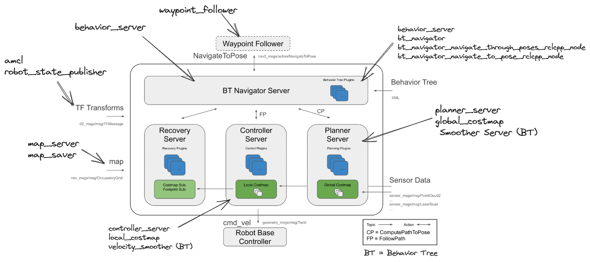
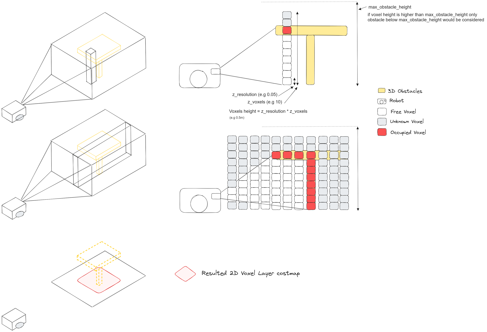

# ROS Navigation Tutorial

## 0. Introduction

The following document presents an incremental overview of the different ROS configuration files and parameters used in Ros Navigation Package.
Before starting have a look to the following resources:
 - ROS [Nav2](https://navigation.ros.org/) documentation
 - ROS [Nav2 general concepts](https://navigation.ros.org/concepts/index.html) documentation
 - ROS [Nav2 costmap_2d](https://navigation.ros.org/configuration/packages/configuring-costmaps.html) documentation
 - ROS [Nav2 costmap_2d github](https://navigation.ros.org/configuration/packages/configuring-costmaps.html) package

Most of navigation concepts come from ROS1 also have a look to 
 - ROS wiki page of [Basic Navigation Tuning Guide](http://wiki.ros.org/navigation/Tutorials/Navigation%20Tuning%20Guide)
 - The excellent ROS navigation tuning guide providing by Kaiyu Zheng [here](http://kaiyuzheng.me/documents/navguide.pdf)

- A Complete introduction is also available here
<!--
<iframe width="560" height="315" src="https://www.youtube.com/embed/QB7lOKp3ZDQ" title="YouTube video player" frameborder="0" allow="accelerometer; autoplay; encrypted-media; gyroscope; picture-in-picture; " allowfullscreen></iframe>
-->
[](https://www.youtube.com/watch?v=QB7lOKp3ZDQ "Nav2")

- The global Nav2 Architecture can be summerize in the following picture:


## 1. Start Simulation and Mapping
### 1.1. Start simulator for mapping
- Follow the instructions provided in the section **Start Simlation for mapping** of the [readme.md](./readme.md).
### 1.2. Configure Rviz 
- Configure Rviz to see the following:
  - Map generated (topic `/map`)
  - Laser information (topic `/scan`)
    - `Style`: Boxes
    - `Size`: 0.07
    - `Color Transformer`: FlatColor
    - `Color`: 255; 0; 0
  
### 1.3 Map the environment
  - Begin to map the environment with the teleop
  - Once a first map is received change the fixed frame of `rviz` to `/map`.
  > - What happened when the robot move ? Why ?
  - Remember how the map is built (behaviour of affordance map)
  > - What happened when your robot tries to map a long corridor ? Explain

### 1.4 Map files
  - After mapping some rooms, save your map with the following command (you can see references here [https://navigation.ros.org/tutorials/docs/navigation2_with_slam.html](https://navigation.ros.org/tutorials/docs/navigation2_with_slam.html)):

  ```
    ros2 run nav2_map_server map_saver_cli -f ~/map
  ```
  - 2 files are generated:
    - `myMap.yaml`
    - `myMap.pgm`
  
  - Open the myMap.yaml and explain each lines


<!--- NEED TO BE UPDATED ADD A NEW LASER SCAN SOURCE
### 1.5 Change observation source
  - Stop your gmapping node
  - Uncomment the following line in the `gmapping_demo.launch` file
  ```xml
    <arg name="scan_topic"  default="kinect_scan" />
  ```
  - This line changes the observation source from laser to kinect "laser"
  - Start again your gmapping node and try to map the environment
  - What do you observe ? Why ?
-->

### 1.6 ref
  - [https://index.ros.org/p/nav2_map_server/](https://index.ros.org/p/nav2_map_server/)


## 2. Start simulation env.


- Follow the instructions provided in the section **Start Simlation for navigation** of the [readme.md](./readme.md).

- Check that in the env. is correctly load into gazebo (env. plus robot).

- Teleoperate the robot into the simulation.

```
ros2 run teleop_twist_keyboard teleop_twist_keyboard
```

### 2.1 Understand default configuration
- Open the  configuration file `nav2_params_empty.yaml` from the `params/` folder
```yaml
global_costmap:
  global_costmap:
    ros__parameters:
      update_frequency: 1.0 
      publish_frequency: 1.0
      global_frame: map    
      robot_base_frame: base_link
      use_sim_time: True
      robot_radius: 0.22   
      resolution: 0.05     
      track_unknown_space: true 
      plugins: ["static_layer"] 
      static_layer:
        plugin: "nav2_costmap_2d::StaticLayer" 
        map_subscribe_transient_local: True   
      always_send_full_costmap: True

local_costmap:
  local_costmap:
    ros__parameters:
      update_frequency: 5.0
      publish_frequency: 2.0
      global_frame: odom
      robot_base_frame: base_link
      use_sim_time: True
      rolling_window: true
      width: 8
      height: 8
      resolution: 0.05
      robot_radius: 0.22
      plugins: ["static_layer"]
      static_layer:
        plugin: "nav2_costmap_2d::StaticLayer"
        map_subscribe_transient_local: True
      always_send_full_costmap: True
amcl:
  ...
bt_navigator:
  ...
bt_navigator_navigate_through_poses_rclcpp_node:
  ...
bt_navigator_navigate_to_pose_rclcpp_node:
  ...
controller_server:
  ...  
map_server:
  ...
map_saver:
  ...
planner_server:
  ...
smoother_server:
  ...
behavior_server:
  ...
robot_state_publisher:
  ...
waypoint_follower:
  ...
velocity_smoother:
  ...
```

-  In this configuration file, main navigation components are addressed :



- In this tutorial we will focus on cost map
- What is the difference between `local` and `global_costmap`, What is the purpose of each costmap ?

> - In the global costmap explain the following:
>   - `update_frequency`
>   - `resolution: 0.05`
>   - `static_layer`


### 2.1 Test default configuration

- Try to ask a navigation throught riz
    1. Relocate the robot using the **2D Pose Estimate** tool
    1. Ask goal with the **2D Nav Goal** tool

> - What happened when the robot tries to cross a door ? Why ?


## 3. Inflate layer

### 3.1 Configuration

1. Copy the configuration file `nav2_params_empty.yaml` from the `params/` folder to the `params/nav2_params_inflate.yaml`.


### 3.2 Add an inflate layer
In the configuration file **nav2_params_inflate.yaml**, define an inflate layer (follow documentation in [https://navigation.ros.org/configuration/packages/costmap-plugins/inflation.html](https://navigation.ros.org/configuration/packages/costmap-plugins/inflation.html)) as follow:
```yaml
global_costmap:
  global_costmap:
    ros__parameters:
      update_frequency: 1.0 
      publish_frequency: 1.0
      global_frame: map    
      robot_base_frame: base_link
      use_sim_time: True
      robot_radius: 0.22   
      resolution: 0.05     
      track_unknown_space: true 
      plugins: ["static_layer","inflation_layer"] 
      inflation_layer:
        plugin: "nav2_costmap_2d::InflationLayer"
        cost_scaling_factor: 3.0
        inflation_radius: 0.55
      static_layer:
        plugin: "nav2_costmap_2d::StaticLayer" 
        map_subscribe_transient_local: True   
      always_send_full_costmap: True
...
```

> Find the definition of each parameter:
> - Global parameters:
>    - robot_radius : radius of the robot use to compute cost into inflate layer (refer to inscribed_radius)
> - [Static layer](https://navigation.ros.org/configuration/packages/costmap-plugins/static.html)
> - [Inflation layer](https://navigation.ros.org/configuration/packages/costmap-plugins/inflation.html)

Restart your simulation for navigation and try a new navigation order through Rviz.

 Display the **/global_costmap/costmap** into rviz.

> What happened with the new configuration ? Explain the different robot trajectories ?

### 3.2 Impact of inflate layer parameters on navigation path

Launch the following command:

```
ros2 run rqt_reconfigure rqt_reconfigure
```

<!-- 
Need a capure of rqt reconfigure here

-->

Play with different values to see the impact on the **/global_costmap/costmap**


Try to make plan into the map through the make_plan service (move_base package) to see the influence of the parameter variations

<!-- TODO FIND THE SERVICE AND COMMAND EXAMPLE
E.g of make_plan command
```
rosservice call /move_base/make_plan "start:
  header:
    seq: 0
    stamp:
      secs: 0
      nsecs: 0
    frame_id: 'map'
  pose:
    position:
      x: -4.16
      y: 1.57
      z: 0.0
    orientation:
      x: 0.0
      y: 0.0
      z: 0.0
      w: 1.0
goal:
  header:
    seq: 0
    stamp:
      secs: 0
      nsecs: 0
    frame_id: 'map'
  pose:
    position:
      x: -4.0
      y: -5.0
      z: 0.0
    orientation:
      x: 0.0
      y: 0.0
      z: 0.0
      w: 1.0
tolerance: 0.5"

```
-->

> Explain the impact of the parameters. (see [ROS1 inflate layer](http://wiki.ros.org/costmap_2d/hydro/inflation))


In gazebo, add an obstacle in front of the robot. Try to send an order of navigation through rviz. What happen ? Why ?


## 4. Obstacle layer


### 4.1 Configuration
1. Copy the configuration file `nav2_params_nav2_params_inflate.yaml` from the `params/` folder to the `params/nav2_params_local_obstacle.yaml`.

2. start the simulator with the new configuration file 


### 4.2 Add an obstacle layer
In the configuration file **nav2_params_local_obstacle.yaml**, define an obstacle layer (follow documentation in costmap_2d) :

```yaml
local_costmap:
  local_costmap:
    ros__parameters:
      update_frequency: 5.0
      publish_frequency: 2.0
      global_frame: odom
      robot_base_frame: base_link
      use_sim_time: True
      rolling_window: true
      width: 8
      height: 8
      resolution: 0.05
      robot_radius: 0.22
      plugins: ["obstacle_layer"]
      obstacle_layer:
        plugin: "nav2_costmap_2d::ObstacleLayer"
        enabled: False
        combination_method: 1
        observation_sources: scan
        scan:
          topic: /scan
          max_obstacle_height: 2.0
          clearing: True
          marking: True
          data_type: "LaserScan"
          raytrace_max_range: 3.0
          raytrace_min_range: 0.0
          obstacle_max_range: 2.5
          obstacle_min_range: 0.0
      static_layer:
        plugin: "nav2_costmap_2d::StaticLayer"
        map_subscribe_transient_local: True
      always_send_full_costmap: True
```
- 
>Find the definition of each parameter ([ROS2 Nav2](https://navigation.ros.org/configuration/packages/costmap-plugins/obstacle.html),[ROS1 obstacle layer](http://wiki.ros.org/costmap_2d/hydro/obstacles)):
> - obstacle_layer:
>  - combination_method
>    - track_unknown_space
>  - Sensor management parameter
>    - observation_sources
>    - max_obstacle_height
>    - obstacle_max_range
>    - raytrace_max_range

>  - Which kind of information is used as observation source ? Is there any alternative ?

Following the document of the [costmap_2d](http://wiki.ros.org/costmap_2d) explain each parameters.


### 4.3 First test of the obstacle layer

Restart your simulation.

Display the **local_costmap/costmap** into rviz.

In gazebo, add an obstacle in front of the robot (visible by the laser).

> Try to  send an order of navigation through rviz. What happen ? Why ?


### 4.4 Add a custom inflate layer to the local planner

In order to avoid correctly the obstacle, create a new inflate layer into the **nav2_params_local_obstacle.yaml**

```yaml
local_costmap:
  local_costmap:
    ros__parameters:
      update_frequency: 5.0
      publish_frequency: 2.0
      global_frame: odom
      robot_base_frame: base_link
      use_sim_time: True
      rolling_window: true
      width: 8
      height: 8
      resolution: 0.05
      robot_radius: 0.22
      #Line below updated
      plugins: ["obstacle_layer","inflation_layer"]
      obstacle_layer:
        plugin: "nav2_costmap_2d::ObstacleLayer"
        enabled: False
        combination_method: 1
        observation_sources: scan
        scan:
          topic: /scan
          max_obstacle_height: 2.0
          clearing: True
          marking: True
          data_type: "LaserScan"
          raytrace_max_range: 3.0
          raytrace_min_range: 0.0
          obstacle_max_range: 2.5
          obstacle_min_range: 0.0
      ##### New Section #####
      inflation_layer:
        plugin: "nav2_costmap_2d::InflationLayer"
        cost_scaling_factor: 3.0
        inflation_radius: 0.55
      #######################
      static_layer:
        plugin: "nav2_costmap_2d::StaticLayer"
        map_subscribe_transient_local: True
      always_send_full_costmap: True

```


### 4.5 Second test of the obstacle layer

Restart your simulation.

Display the **local_costmap/costmap** into rviz.

In gazebo, add an obstacle in front of the robot (visible by the laser).

> Try to  send an order of navigation (rviz). What happen ? Why ?


### 4.5bis Order of layers
- change the order of layers into the confiration file like following:

```yaml
  ...
 plugins: ["inflation_layer", "obstacle_layer"]
 ...
```
> - Make the test again has explain in 4.5, What happens ? Why ?

- Reset your configuration file to be again in the following conifguration 

```yaml
  ...
 plugins: ["obstacle_layer", "inflation_layer"]
 ...
```

### 4.6 Third test of the obstacle layer

Reduce the size of the local costmap window:

```yaml
local_costmap:
 ...
  width: 4
  height: 4
  resolution: 0.05
 ...

```

Restart your simulation.

In gazebo, move your robot into a room with 4 doors.

Add an obstacle into rviz blocking the closest door.

Using rviz, ask your robot to navigate to another room avoiding the new obstacle

> Does the global planner take into account the obstacle ? Why ?

Ask the robot to navigate far from the blocked door. Then ask it again to reach a goal behind the door blocked by the obstacle.
> What happen ? Why ?

> How is it possible to fix that ?


## 6 Add an obstacle layer to the global costmap

### 6.1 Configuration
1. Copy the configuration file `nav2_params_local_obstacle.yaml` from the `params/` folder to the `params/nav2_params_local_global_obstacle.yaml`.

2. Start the simulator with the new configuration file 

### 6.2 Update the global costmap.

As see before, the `planner_server` needs to be informed of new obstacles in order to provide new general trajectories. To do so, the global costmap configuration show be modified:

Modify the **global_costmap** configuration file as follow:

```yaml
global_costmap:
  global_costmap:
    ros__parameters:
      update_frequency: 1.0 
      publish_frequency: 1.0
      global_frame: map    
      robot_base_frame: base_link
      use_sim_time: True
      robot_radius: 0.22   
      resolution: 0.05     
      track_unknown_space: true 
      #Line below updated
      plugins: ["static_layer","obstacle_layer", "inflation_layer"] 
      ##### New Section #####
      obstacle_layer:
        plugin: "nav2_costmap_2d::ObstacleLayer"
        enabled: False
        combination_method: 1
        observation_sources: scan
        scan:
          topic: /scan
          max_obstacle_height: 2.0
          clearing: True
          marking: True
          data_type: "LaserScan"
          raytrace_max_range: 3.0
          raytrace_min_range: 0.0
          obstacle_max_range: 2.5
          obstacle_min_range: 0.0
      #######################
      inflation_layer:
        plugin: "nav2_costmap_2d::InflationLayer"
        cost_scaling_factor: 3.0
        inflation_radius: 0.55
      static_layer:
        plugin: "nav2_costmap_2d::StaticLayer" 
        map_subscribe_transient_local: True   
      always_send_full_costmap: True
```


### 6.3 Test of the obstacle layer on both local and global costmap

Restart your simulation.

In gazebo, move your robot to a room with 4 doors.

Add an obstacle into rviz that block the closest door.

Through rviz ask your robot to navigation to another room avoiding the new obstacle

> What happen ? Why ? what is the difference with the new  **/global_costmap/costmap** into rviz ? Why ?


## 7. Add 3d obstacle detection

### 7.1 Configuration

1. Copy the configuration file `nav2_params_local_global_obstacle.yaml` from the `params/` folder to the `params/nav2_params_3D_local_global_obstacle.yaml`.

2. Start the simulator with the new configuration file 

### 7.2 First Test with 3D obstacle
Restart your simulation.

Display the **/local_costmap/costmap** into rviz.

In gazebo, add a table obstacle in front of the robot.

Ask the robot to navigate behind the table.

> What happened ? why ?

Display the PointCloud2 of the **/camera/depth/points** topic into rviz.

> What can you conclude ?


### 7.3 Add a source of observation

Go into the **nav2_params_3D_local_global_obstacle.yaml** configuration file and add a new `voxel` costmap layer:

```yaml
local_costmap:
  local_costmap:
    ros__parameters:
      update_frequency: 5.0
      publish_frequency: 2.0
      global_frame: odom
      robot_base_frame: base_link
      use_sim_time: True
      rolling_window: true
      width: 5
      height: 5
      resolution: 0.05
      robot_radius: 0.22
      #Line below updated
      plugins: ["obstacle_layer", "voxel_layer","inflation_layer"]
      obstacle_layer:
        plugin: "nav2_costmap_2d::ObstacleLayer"
        enabled: False
        combination_method: 1
        observation_sources: scan
        scan:
          topic: /scan
          max_obstacle_height: 2.0
          clearing: True
          marking: True
          data_type: "LaserScan"
          raytrace_max_range: 3.0
          raytrace_min_range: 0.0
          obstacle_max_range: 2.5
          obstacle_min_range: 0.0
      ##### New Section #####
      voxel_layer:
        plugin: "nav2_costmap_2d::VoxelLayer"
        enabled: True
        publish_voxel_map: True
        origin_z: 0.0
        z_resolution: 0.05
        z_voxels: 16
        max_obstacle_height: 2.0
        mark_threshold: 0
        combination_method: 1
        observation_sources: cam
        cam:
          topic: /intel_realsense_r200_depth/points
          min_obstacle_height: 0.2
          max_obstacle_height: 2.0
          clearing: True
          marking: True
          data_type: "PointCloud2"
      #######################
      inflation_layer:
        plugin: "nav2_costmap_2d::InflationLayer"
        cost_scaling_factor: 3.0
        inflation_radius: 0.55simulation/gazebo/gazebo_sim_nav/readme.md
      static_layer:
        plugin: "nav2_costmap_2d::StaticLayer"
        map_subscribe_transient_local: True
      always_send_full_costmap: True
```
> What is the difference between  `voxel_layer` and `obstacle_layer` ?

For a good configuration of the 3D sensor, you must adjust the parameters of the **VoxelCostmapPlugin**. Have a look to the [ROS navigation tuning guide](http://kaiyuzheng.me/documents/navguide.pdf), page 13 to get more detail about Voxel. For Nav2 parameters references you see the following page [Nav2 Voxel Layer]()

- In a nutsheel the following picture sumup Voxel parameters:




### 7.4 Second with 3D obstacle
Restart your simulation.

Display the **local_costmap/costmap** into rviz.

In gazebo, add a table obstacle in front of the robot.

Ask the robot to navigate behind the table.

> What happened ? why ?
