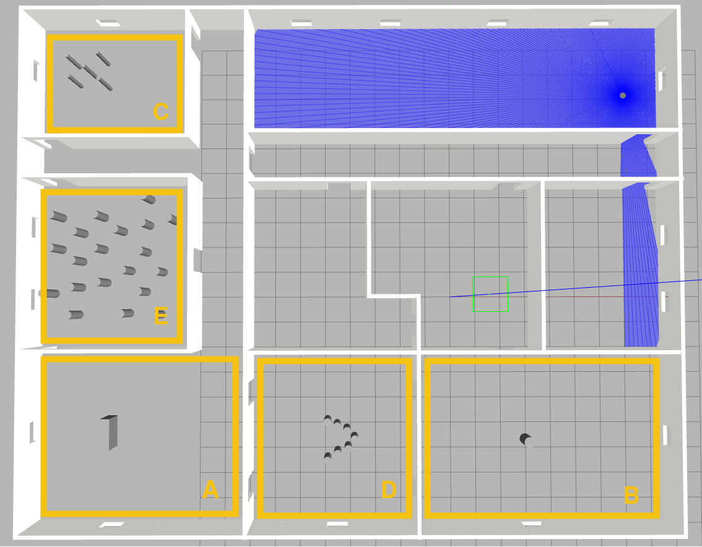

# ROS Navigation Tutorial: Local Planner
## Before Starting

### Start configuration
#### For simulator install only 
  - If Simulator is not installed check prerequisite of [install and use](./readme.md).

#### Download the training package
  - If you haven't got a ros workspace, create one
    ```
       mkdir -p ~/ros_ws/src
       cd ~/ros_ws
       colcon build
    ```
  - Clone the current repository into the src of your workspace
    ```
      cd ~/ros_ws/src
      git clone https://github.com/jacques-saraydaryan/training-turtlebot-simulator-student.git
    ```
  - Compile the new ros package
    ```
      cd ~/ros_ws
      colcon build
    ```
  - source the current ros workspace
    ```
        cd ~/ros_ws
        source install/setup.bash
    ```

#### Setup Env.
- CAUTION Before all commands you launch, you need to setup the following Ros variable
  - Configure your ROS to communicate only on localhost
    ```
    export ROS_LOCALHOST_ONLY=1
    ```  
  - Some issues as been identified with default dss use cyclonedds instead
    ```
    export RMW_IMPLEMENTATION=rmw_cyclonedds_cpp
    ```
  - set default end directory 

    ```
    source /opt/ros/humble/setup.bash
    export TURTLEBOT3_MODEL=waffle
    export GAZEBO_MODEL_PATH=$GAZEBO_MODEL_PATH:/opt/ros/humble/share/turtlebot3_gazebo/models
    ```
- Tips : Save all these commands into your `~/.bashrc` file

#### Start simulation for Navigation
- CAUTION: Before all commands be sure to Setup Env. as above
- Launch Gazebo, Localization, navigation and tools.

  ```
  cd src/training-turtlebot-simulator-student/simulation/gazebo/gazebo_sim_nav/params/
  ros2 launch gazebo_sim_nav tb3_simulation_launch.py headless:=False params_file:="nav2_params_empty.yaml" map:="<your absolute map path>/<your map>.yaml"
  ```

- On rviz set "2d pose estimate" 

## 1. Introduction

The following document presents an incremental overview of the different ROS  controller server configuration (old local planner configuration )
Before starting have a look to the following resources:
 - ROS 2 [Nav2 Controller Server](https://navigation.ros.org/configuration/packages/configuring-controller-server.html)
 - ROS [Nav2 general concepts](https://navigation.ros.org/concepts/index.html) documentation
 - ROS [Nav2 costmap_2d](https://navigation.ros.org/configuration/packages/configuring-costmaps.html) documentation
 - ROS [Nav2 costmap_2d github](https://navigation.ros.org/configuration/packages/configuring-costmaps.html) package

Example of expected result:

[](https://www.youtube.com/watch?v=kudmGqGd-3o)


## 2. Start simulation env.


- Follow the instructions provided in the section **Start Simlation for navigation**.
```
cd src/training-turtlebot-simulator-student/simulation/gazebo/gazebo_sim_nav/params/
ros2 launch gazebo_sim_nav tb3_simulation_local_launch.py headless:=True params_file:="nav2_params_local.yaml"
```

- Check that in the env. is correctly load into gazebo (env. plus robot).

- Check that the robot is correctly localized (AMCL green arrow).


- Try to ask a navigation throught riz
    1. Relocate the robot using the **2D Pose Estimate** tool if needed
    1. Ask goal with the **2D Nav Goal** tool

>  - What means the path with arrows path ?
> -  What means the blue path ?


## 3. Navigation Loop

To test the different configuration of local planner, we will first create a node **nav_loop.py** allowing the robot to reach the point A, and when reached go to the B pt. When the pt B is reached robot needs to navigation again to the point A.

1. Go to the following folder
```
cd src/training-turtlebot-simulator-student/simulation/gazebo/gazebo_sim_nav/gazebo_sim_nav
```

2. Create the **nav_loop.py** 
3. Complete this file such as the created node use `BasicNavigator` to send a goal and check if the goal is reached or not (follow the recommandation  here [https://docs.nav2.org/commander_api/index.html](https://docs.nav2.org/commander_api/index.html))
4. the point A should have the following configuration
```
{'header':{'frame_id':'map'},'pose':{'position':{'x':-0.1222,'y':-5.526},'orientation':{'z':0,'w':1}}}
```

5. the point B should have the following configuration
```
{'header':{'frame_id':'map'},'pose':{'position':{'x':6.45,'y':-5.526},'orientation':{'z':1,'w':0}}}
```

Tips: Do not forget to update the `console_scripts` in the `setup.py`.

## 4. Play with DWA Local Planner

In the following section, the different DWA parameters are studied.
For each different env. configuration the following parameters have to be updated (detailed information is available here [https://docs.nav2.org/configuration/packages/configuring-dwb-controller.html](https://docs.nav2.org/configuration/packages/configuring-dwb-controller.html))
- PathDist.scale
- GoalDist.scale
- PathAlign.scale
- GoalAlign.scale
- BaseObstacle.scale
- RotateToGoal.scale

- Start the dynamic configuration edition with the following command:
  
  ```
  ros2 run rqt_reconfigure rqt_reconfigure
  ```
- In the following window, select only **contoller_server**
- all presented parameters can be modified and modifications are automatically apply to the current planner

The planner would be tested into the following areas:



>[NOTE!]
> Dynamic parameters are not supported by the actual `controller_server` for applying your modification you need to modify `nav2_params_local.yaml` file and restart simulation

### 4.1 Simple known Obstacle Avoidance
- **Into gazebo**, move  your robot into the room A
<!-- - **Into rviz**,  update the **2D estimate pose** of the robot to fit the environment  -->
- Update your **nav_loop.py** file with the following point 

- the point A :
```
{'header':{'frame_id':'map'},'pose':{'position':{'x':-15.4,'y':-5.27},'orientation':{'z':0,'w':1}}}
```

  - the point B :

```
{'header':{'frame_id':'map'},'pose':{'position':{'x':-10.8,'y':-5.27},'orientation':{'z':1,'w':0}}}
```

- Change the parameter **GoalDist.scale** by **10.0** value
- Execute several goals
- What happen ? Why

- Set parameter **GoalDist.scale** to **1.0** and change the **PathDist.scale** value by **10.0** value
- Execute several goals
- What happen ? Why

- Set parameter **PathDist.scale** to **1.0** and change the **BaseObstacle.scale** value by **10.0** value
- Execute several goals
- What happen ? Why

- Execute several goals
- What happen ? Why

- FInd the optimal parameter configuration for this situation

### 4.2 Simple unknown Obstacle Avoidance
- **Into gazebo**, teleport your robot into the room B
- **Into rviz**,  update the **2D estimate pose** of the robot
- Update your **nav_loop.py** file with the following point 

- the point A :
```
{'header':{'frame_id':'map'},'pose':{'position':{'x':-0.1222,'y':-5.526},'orientation':{'z':0,'w':1}}}
```

  - the point B :

```
{'header':{'frame_id':'map'},'pose':{'position':{'x':6.45,'y':-5.526},'orientation':{'z':1,'w':0}}}
```
- Restore your DWA initial configuration

- Change the parameter **GoalDist.scale** by **10.0** value
- Execute several goals
- What happen ? Why

- Set parameter **GoalDist.scale** to **1.0** and change the **PathDist.scale** value by **10.0** value
- Execute several goals
- What happen ? Why

- Set parameter **PathDist.scale** to **1.0** and change the **BaseObstacle.scale** value by **10.0** value
- Execute several goals
- What happen ? Why

- Set parameter **PathDist.scale** to **10.0** and change the **PathAlign.scale** value by **10.0** value
- Execute several goals
- What happen ? Why

- FInd the optimal parameter configuration for this situation


### 4.3 Complex known Obstacles Avoidance
- **Into gazebo**, teleport your robot into the room C
- **Into rviz**,  update the **2D estimate pose** of the robot
- Update your **nav_loop.py** file with the following point 

- the point A :
```
{'header':{'frame_id':'map'},'pose':{'position':{'x':-15.6,'y':8.92},'orientation':{'z':0,'w':1}}}
```

  - the point B :

```
{'header':{'frame_id':'map'},'pose':{'position':{'x':--13.1,'y':8.92},'orientation':{'z':1,'w':0}}}
```
- Restore your DWA initial configuration

- Change the parameter **GoalAlign.scale** by **10.0** value
- Execute several goals
- What happen ? Why

- Set parameter **GoalAlign.scale** to **1.0** and change the **PathDist.scale** value by **10.0** value
- Execute several goals
- What happen ? Why

- Set parameter **PathDist.scale** to **1.0** and change the **PathAlign.scale** value by **10.0** value
- Execute several goals
- What happen ? Why

- Set parameter **PathAlign.scale** to **1.0** and change the **GoalAlign.scale** value by **10.0** value
- Execute several goals
- What happen ? Why

- Tips: try to update also the parameter **sim_time** (e.g 5.0) and test again your configurations.

- FInd the optimal parameter configuration for this situation


### 4.3 Complex unknown Obstacles Avoidance
- **Into gazebo**, teleport your robot into the room D
- **Into rviz**,  update the **2D estimate pose** of the robot
- Update your **nav_loop.py** file with the following point 

- the point A :
```
{'header':{'frame_id':'map'},'pose':{'position':{'x':-6.09,'y':-5.57},'orientation':{'z':1,'w':0}}}
```

  - the point B :

```
{'header':{'frame_id':'map'},'pose':{'position':{'x':-3.15,'y':-5.57},'orientation':{'z':0,'w':1}}}
```
- Restore your DWA initial configuration

- Play with different parameters to allow your robot to cross such obstacle

- Tips: try to update also the parameter **sim_time** (e.g 5.0) and test again your configurations.

- Find the optimal parameter configuration for this situation


## 5. Play with TED Local Planner
coming soon...

## 6. Create your own local Planner
coming soon...

## 7. Gazebo Tips:
Depending of your configuration, some parameters should be ajusted to get the current world correctly running.
- Click on **physics** field:


- You can play with 2 criteria to optimize gazebo behavior
  - **real time update rate** :  parameter specifies in Hz the number of physics updates that will be attempted per second. If this number is set to zero, it will run as fast as it can.
  - **max step size** :  specifies the time duration in seconds of each physics update step.

  (more information is available at [http://gazebosim.org/tutorials/?tut=modifying_world](http://gazebosim.org/tutorials/?tut=modifying_world)


  


