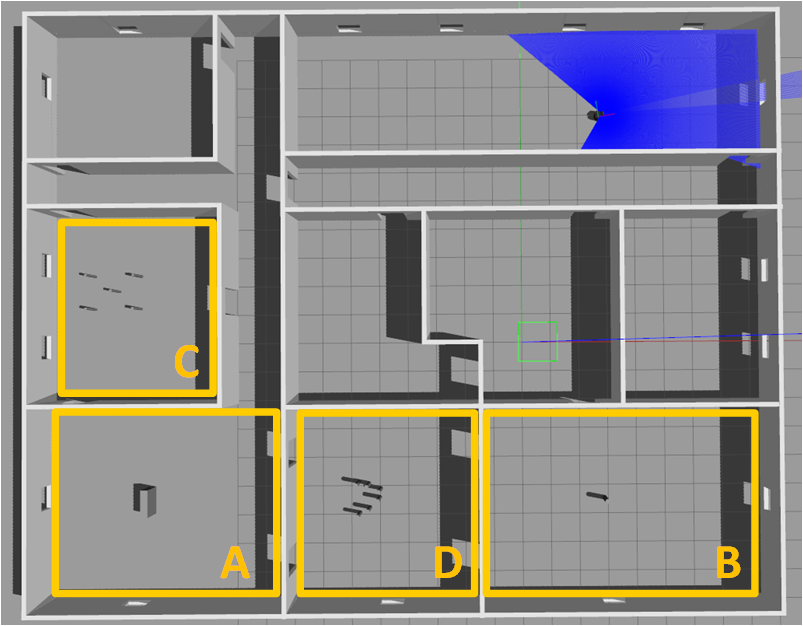
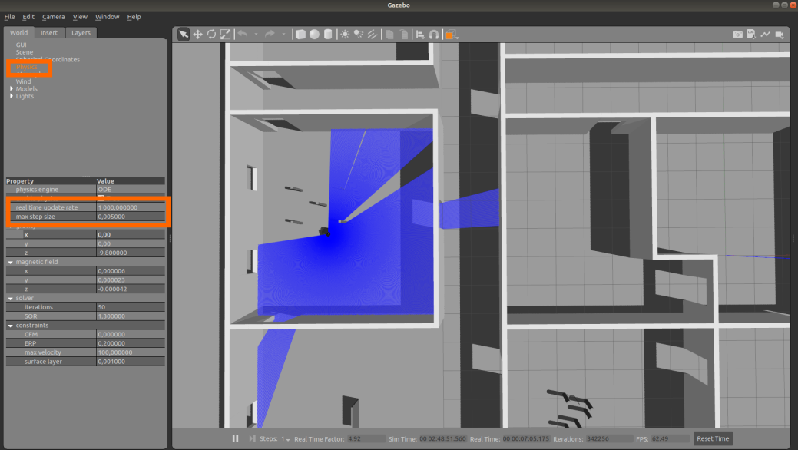

# ROS Navigation Tutorial: Local Planner

## 1. Introduction

The following document presents an incremental overview of the different ROS local planner configuration 
Before starting have a look to the following resources:
 - ROS [move_base](http://wiki.ros.org/move_base) package
 - ROS [costmap_2d](http://wiki.ros.org/costmap_2d) package
 - ROS wiki page of [Basic Navigation Tuning Guide](http://wiki.ros.org/navigation/Tutorials/Navigation%20Tuning%20Guide)
 - The excellent ROS navigation tuning guide providing by Kaiyu Zheng [here](http://kaiyuzheng.me/documents/navguide.pdf)

Example of expected result:

[](https://www.youtube.com/watch?v=kudmGqGd-3o)


## 2. Start simulation env.


- Follow the instructions provided in the section **Start Simlation for navigation**.
```
roslaunch turtlebot_gazebo turtlebot_navigation_local_planner_world.launch
roslaunch turtlebot_gazebo amcl_demo_local_planner.launch

```

```
roscd turtlebot_gazebo/maps/
rosrun map_server map_server roomv1_local_planner.yaml
```

 Use the **move_base_localPlanner_DWA.launch.xml** in the **amcl_demo_local_planner.launch** to start the basic configuration.

- Check that in the env. is correctly load into gazebo (env. plus robot).

- Check that the robot is correctly localized (AMCL red arrow).


- Try to ask a navigation throught riz
    1. Relocate the robot using the **2D Pose Estimate** tool if needed
    1. Ask goal with the **2D Nav Goal** tool

- What means the green path ?
- What means the blue path ?


## 3. Navigation Loop

To test the different configuration of local planner, we will first create a node **nav_loop.py** allowing the robot to reach the point A, and when reached go to the B pt. When the pt B is reached robot needs to navigation again to the point A.

1. Go to the following folder
```
roscd turtlebot_gazebo/scripts
```

2. Create the **nav_loop.py** 
3. Complete this file such as the created node user naviagation action to send a goal and check if the goal is reached or not (follow the recommandation here http://wiki.ros.org/navigation/Tutorials/SendingSimpleGoals)
4. the point A should have the following configuration
```
{'header':{'frame_id':'map'},'pose':{'position':{'x':-0.1222,'y':-5.526},'orientation':{'z':0,'w':1}}}
```

5. the point B should have the following configuration
```
{'header':{'frame_id':'map'},'pose':{'position':{'x':6.45,'y':-5.526},'orientation':{'z':1,'w':0}}}
```

## 4. Play with DWA Local Planner

In the following section, the different DWA parameters are studied.
For each different env. configuration the following parameters have to be updated.
- global_distance_biais
- path_distance_biais
- occdist_scale
- twinling_scale

- Start the dynamic configuration edition with the following command:
  
  ```
  rosrun rqt_reconfigure rqt_reconfigure
  ```
- In the following window, select only **DWAPlannerROS**
- all presented parameters can be modified and modifications are automatically apply to the current planner

The planner would be tested into the following areas:



### 4.1 Simple known Obstacle Avoidance
- **Into gazebo**, teleport your robot into the room A
- **Into rviz**,  update the **2D estimate pose** of the robot to fit the environment
- Update your **nav_loop.py** file with the following point 

- the point A :
```
{'header':{'frame_id':'map'},'pose':{'position':{'x':-14.666,'y':-5.168},'orientation':{'z':0,'w':1}}}
```

  - the point B :

```
{'header':{'frame_id':'map'},'pose':{'position':{'x':-9.4343,'y':-5.526},'orientation':{'z':1,'w':0}}}
```

- Change the parameter **global_distance_biais** by **10.0** value
- Execute several goals
- What happen ? Why

- Set parameter **global_distance_biais** to **1.0** and change the **path_distance_biais** value by **10.0** value
- Execute several goals
- What happen ? Why

- Set parameter **path_distance_biais** to **1.0** and change the **occdist_scale** value by **10.0** value
- Execute several goals
- What happen ? Why

- Set parameter **occdist_scale** to **1.0** and change the **twinling_scale** value by **10.0** value
- Execute several goals
- What happen ? Why

- FInd the optimal parameter configuration for this situation

### 4.2 Simple unknown Obstacle Avoidance
- **Into gazebo**, teleport your robot into the room B
- **Into rviz**,  update the **2D estimate pose** of the robot
- Update your **nav_loop.py** file with the following point 

- the point A :
```
{'header':{'frame_id':'map'},'pose':{'position':{'x':-0.1222,'y':-5.526},'orientation':{'z':0,'w':1}}}
```

  - the point B :

```
{'header':{'frame_id':'map'},'pose':{'position':{'x':6.45,'y':-5.526},'orientation':{'z':1,'w':0}}}
```
- Restore your DWA initial configuration

- Change the parameter **global_distance_biais** by **10.0** value
- Execute several goals
- What happen ? Why

- Set parameter **global_distance_biais** to **1.0** and change the **path_distance_biais** value by **10.0** value
- Execute several goals
- What happen ? Why

- Set parameter **path_distance_biais** to **1.0** and change the **occdist_scale** value by **10.0** value
- Execute several goals
- What happen ? Why

- Set parameter **occdist_scale** to **1.0** and change the **twinling_scale** value by **10.0** value
- Execute several goals
- What happen ? Why

- FInd the optimal parameter configuration for this situation


### 4.3 Complex known Obstacles Avoidance
- **Into gazebo**, teleport your robot into the room C
- **Into rviz**,  update the **2D estimate pose** of the robot
- Update your **nav_loop.py** file with the following point 

- the point A :
```
{'header':{'frame_id':'map'},'pose':{'position':{'x':-15.513,'y':1.743},'orientation':{'z':0,'w':1}}}
```

  - the point B :

```
{'header':{'frame_id':'map'},'pose':{'position':{'x':-11.982,'y':1.743},'orientation':{'z':1,'w':0}}}
```
- Restore your DWA initial configuration

- Change the parameter **global_distance_biais** by **10.0** value
- Execute several goals
- What happen ? Why

- Set parameter **global_distance_biais** to **1.0** and change the **path_distance_biais** value by **10.0** value
- Execute several goals
- What happen ? Why

- Set parameter **path_distance_biais** to **1.0** and change the **occdist_scale** value by **10.0** value
- Execute several goals
- What happen ? Why

- Set parameter **occdist_scale** to **1.0** and change the **twinling_scale** value by **10.0** value
- Execute several goals
- What happen ? Why

- Tips: try to update also the parameter **sim_time** (e.g 5.0) and test again your configurations.

- FInd the optimal parameter configuration for this situation


### 4.3 Complex unknown Obstacles Avoidance
- **Into gazebo**, teleport your robot into the room D
- **Into rviz**,  update the **2D estimate pose** of the robot
- Update your **nav_loop.py** file with the following point 

- the point A :
```
{'header':{'frame_id':'map'},'pose':{'position':{'x':-2.72,'y':-5.23},'orientation':{'z':1,'w':0}}}
```

  - the point B :

```
{'header':{'frame_id':'map'},'pose':{'position':{'x':-6.181,'y':-5.526},'orientation':{'z':0,'w':1}}}
```
- Restore your DWA initial configuration

- Change the parameter **global_distance_biais** by **10.0** value
- Execute several goals
- What happen ? Why

- Set parameter **global_distance_biais** to **1.0** and change the **path_distance_biais** value by **10.0** value
- Execute several goals
- What happen ? Why

- Set parameter **path_distance_biais** to **1.0** and change the **occdist_scale** value by **10.0** value
- Execute several goals
- What happen ? Why

- Set parameter **occdist_scale** to **1.0** and change the **twinling_scale** value by **10.0** value
- Execute several goals
- What happen ? Why

- Tips: try to update also the parameter **sim_time** (e.g 5.0) and test again your configurations.

- Find the optimal parameter configuration for this situation


## 5. Play with TED Local Planner
coming soon...

## 6. Create your own local Planner
coming soon...

## 7. Gazebo Tips:
Depending of your configuration, some parameters should be ajusted to get the current world correctly running.
- Click on **physics** field:



- You can play with 2 criteria to optimize gazebo behavior
  - **real time update rate** :  parameter specifies in Hz the number of physics updates that will be attempted per second. If this number is set to zero, it will run as fast as it can.
  - **max step size** :  specifies the time duration in seconds of each physics update step.

  (more information is available at [http://gazebosim.org/tutorials/?tut=modifying_world](http://gazebosim.org/tutorials/?tut=modifying_world)


  


